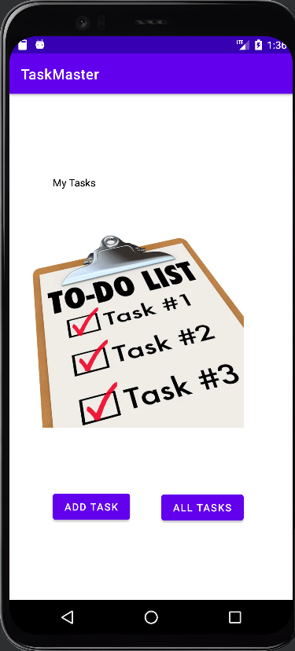
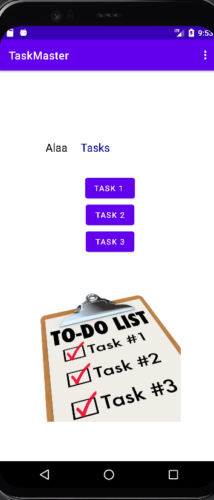
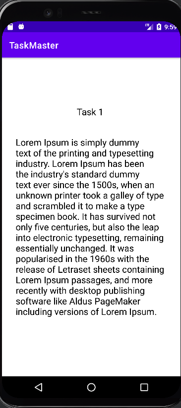

# taskmaster
### Lab 26 
create three Activities   
* Main Activity : has two buttons, Add Task and All Tasks.  
* Add Task Activity : will add the titile and description for the task and submit by click on add button.  
* All Tasks Activity : show the task you added and back button to go back to the Main Activity.  
  
  
### Lab 27
create three Activities   
* Main Activity : has three Tasks buttons, menu for setting, and the username text.  
* Settings Activity : Let the user write his/het user name and submit by click on submit button to save the username.  
* DetailTask Activity : show the task title you pressed and description.  
**Home Page**  
  
**Details Page**  
  