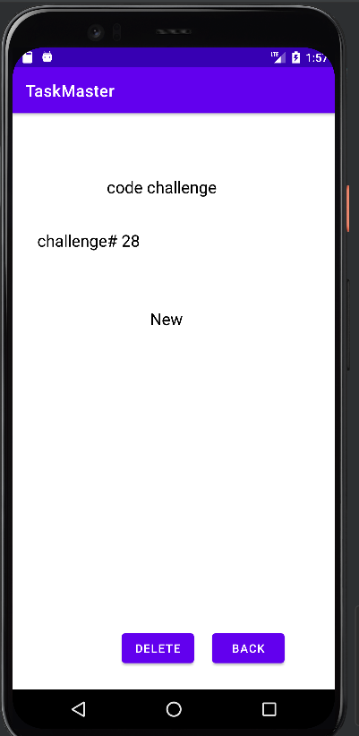

# taskmaster
### Lab 26 
create three Activities   
* Main Activity : has two buttons, Add Task and All Tasks.  
* Add Task Activity : will add the titile and description for the task and submit by click on add button.  
* All Tasks Activity : show the task you added and back button to go back to the Main Activity.  
  
  
### Lab 27
create three Activities   
* Main Activity : has three Tasks buttons, menu for setting, and the username text.  
* Settings Activity : Let the user write his/het user name and submit by click on submit button to save the username.  
* DetailTask Activity : show the task title you pressed and description.  
**Home Page**  
  
**Details Page**  
  

  
### Lab 28
create three Activities   
* Main Activity : has two Tasks buttons, Add Task and All Tasks, the user name , and list for three tasks.  
* Settings Activity : Let the user write his/het user name and submit by click on submit button to save the username.  
* DetailTask Activity : show the task title you pressed, description, and the state for this task.  
* Add CustomAdapter so we can deal with the RecyclerView.   
**Home Page**  
  
**Details Page**  
    
  
### Lab 29
create three Activities   
* Main Activity : has two Tasks buttons, Add Task and All Tasks, the user name , and list for the all tasks.  
* Settings Activity : Let the user write his/het user name and submit by click on submit button to save the username.  
* DetailTask Activity : show the task title you pressed, description, and the state for this task. It has delete button for deleteing this task.  
* Add CustomAdapter so we can deal with the RecyclerView. 
* Add Room Library and use the Database to store the tasks record.    
**Home Page**  
  
**Details Page**  
      

### Lab 31
Only added the Espresso Test.[Test](https://github.com/AlaaYlula/taskmaster/blob/main/taskmaster/app/src/androidTest/java/com/example/taskmaster/ExampleInstrumentedTest.java)  
create three Activities   
* Main Activity : has two Tasks buttons, Add Task and All Tasks, the user name , and list for the all tasks.  
* Settings Activity : Let the user write his/het user name and submit by click on submit button to save the username.  
* DetailTask Activity : show the task title you pressed, description, and the state for this task. It has delete button for deleteing this task.  
* Add CustomAdapter so we can deal with the RecyclerView. 
* Add Room Library and use the Database to store the tasks record.    
**Home Page**  
  
**Details Page**  
      
  
### Lab 32
Start Work with AWS Amplify.  
* Main Activity : has two Tasks buttons, Add Task and All Tasks, the user name , and list for the all tasks(I think still need sync because it has some delay to render the all tasks).  
* Settings Activity : Let the user write his/het user name and submit by click on submit button to save the username.  
* DetailTask Activity : show the task title you pressed, description, and the state for this task. It has delete button for deleteing this task(Not work now). Still not work correctly, I got the correct task in the logcat but not in the Emulator.   
* Add CustomAdapter so we can deal with the RecyclerView. 
* Add  AWS Amplify and use the DynamoDB to store the tasks record.    
**Home Page**  
  
**DynamoDB**  
       
  
### Lab 33
Start Work with AWS Amplify.  
* Main Activity : has two Tasks buttons, Add Task and All Tasks, the user name , and list for the all tasks(The List of tasks must be only the ones which belongs to the team, BUT it doesn't work with me, there is some issue in reading the team name saved).
* Settings Activity : Let the user write his/het user name, chose the team and submit by click on submit button to save the username and the team name.  
* DetailTask Activity : show the task title you pressed, description, and the state for this task. It has delete button for deleteing this task(Not work now).  
* Add CustomAdapter so we can deal with the RecyclerView. 
* Add  AWS Amplify and use the DynamoDB to store the tasks record.    
**Home Page**  
  
**DynamoDB**  
  
  
